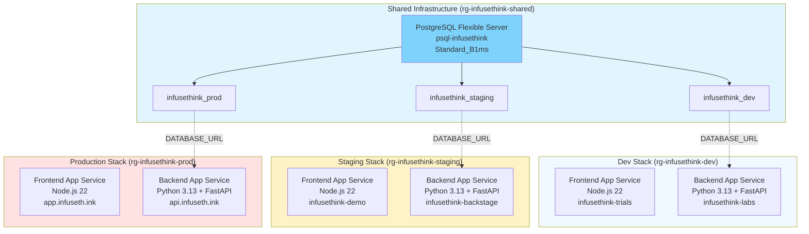

# Infuseth.ink Infrastructure as Code

Infrastructure as Code for Infuseth.ink using Pulumi and Azure. This project manages a cost-optimized multi-environment setup with separate frontend (Node.js) and backend (Python FastAPI) services, sharing a single PostgreSQL server across all environments.

## 🏗️ Architecture Overview

This infrastructure supports a modular, multi-environment setup with separate frontend and backend services, using a **shared PostgreSQL server** architecture for cost optimization.

### Core Architecture



**Cost Savings**: Sharing the PostgreSQL server reduces costs from ~$36/month (3 servers) to ~$12/month (1 server) - **67% savings**.

### Environment Plan

#### Development
- **Frontend**: `infusethink-trials.azurewebsites.net` (Node.js 22)
- **Backend**: `infusethink-labs.azurewebsites.net` (Python 3.13 + FastAPI)
- **Database**: `infusethink_dev` on shared PostgreSQL server
- **Purpose**: Development testing - you can break it, minimal coordination needed

#### Staging
- **Frontend**: `infusethink-demo.azurewebsites.net` (Node.js 22)
- **Backend**: `infusethink-backstage.azurewebsites.net` (Python 3.13 + FastAPI)
- **Database**: `infusethink_staging` on shared PostgreSQL server
- **Purpose**: QA and demo purposes - gatekeeps production

#### Production
- **Frontend**: `app.infuseth.ink` (custom domain) / `infusethink-app.azurewebsites.net` (Node.js 22)
- **Backend**: `api.infuseth.ink` (custom domain) / `infusethink-api.azurewebsites.net` (Python 3.13 + FastAPI)
- **Database**: `infusethink_prod` on shared PostgreSQL server
- **Purpose**: Production environment

### Environment Notes

- **dev**: Experimental environment where any developer can push with minimal coordination. Perfect for testing:
  - Remote environment issues you're not confident testing locally
  - Cookie SameSite policies and cross-origin behavior
  - CDN and caching behavior
  - Sharing a possibly unstable version with team members or stakeholders
  - Offloading backend to free up laptop resources
- **staging**: QA and demonstration environment. Changes require review and gatekeeps production from bugs
  - Final QA testing before production
  - Client demonstrations and previews
- **prod**: Production environment with custom domains and full monitoring

### Azure Services Used

- **Frontend**: Azure App Service (Free tier F1, Node.js 22-lts)
- **Backend**: Azure App Service (Free tier F1, Python 3.13 + FastAPI + Gunicorn)
- **Database**: Azure PostgreSQL Flexible Server v17 (Standard_B1ms burstable tier, ~$12/month shared)

## 🚀 Quick Start

### Prerequisites

✅ Azure CLI authenticated (`az login`)
✅ Pulumi CLI installed
✅ Python 3.13+ with uv installed
✅ Pulumi account configured

### Step 1: Install Dependencies

```bash
uv sync --dev
```

### Step 2: Deploy Shared Infrastructure

The shared infrastructure contains the PostgreSQL server that all environments use:

```bash
cd shared-infra

# Initialize shared stack
pulumi stack init shared

# Configure Azure region
pulumi config set azure-native:location eastasia

# Set database admin password (secure, encrypted)
pulumi config set --secret db_admin_password "YourSecurePassword123!"

# Optional: customize admin username (default: infusethink_admin)
# pulumi config set db_admin_username my_admin

# Deploy shared PostgreSQL server
pulumi up

# Verify deployment
pulumi stack output postgres_server_fqdn
# Should show: psql-infusethink.postgres.database.azure.com

cd ..
```

**This creates:**
- Resource group: `rg-infusethink-shared`
- PostgreSQL Flexible Server v17: `psql-infusethink` (Standard_B1ms)
- Firewall rule allowing Azure services

### Step 3: Deploy Development Environment

```bash
# Initialize dev stack
pulumi stack init dev

# Configure Azure region
pulumi config set azure-native:location eastasia

# Deploy dev environment (no password needed - uses shared stack's password)
pulumi up

# Verify outputs
pulumi stack output frontend_url
# Should show: infusethink-trials.azurewebsites.net

pulumi stack output backend_url
# Should show: infusethink-labs.azurewebsites.net
```

**This creates (in rg-infusethink-dev):**
- Frontend App Service (Node.js 22): `infusethink-trials`
- Backend App Service (Python 3.13 + FastAPI): `infusethink-labs`
- Database on shared server (in rg-infusethink-shared): `infusethink_dev`

### Step 4: Test Your Deployment

```bash
# Test frontend
curl https://$(pulumi stack output frontend_url)

# Test backend health endpoint
curl https://$(pulumi stack output backend_url)/health

# Check database connection (if your backend has a DB test endpoint)
curl https://$(pulumi stack output backend_url)/db/ping
```

### Step 5: Deploy Additional Environments (Optional)

**Staging:**
```bash
pulumi stack init staging
pulumi config set azure-native:location eastasia
pulumi up
```

**Production:**
```bash
pulumi stack init prod
pulumi config set azure-native:location eastasia
pulumi up
```

## 🏗️ Technical Details

### Stack References

Environment stacks automatically reference the shared stack using Pulumi Stack References:

```python
shared_stack = pulumi.StackReference(f"{org_name}/infusethink-shared/shared")
postgres_server_name = shared_stack.require_output("postgres_server_name")
postgres_server_fqdn = shared_stack.require_output("postgres_server_fqdn")
shared_resource_group_name = shared_stack.require_output("resource_group_name")
postgres_admin_password = shared_stack.require_output("postgres_admin_password")
```

**Important:** The password is stored in the shared stack and referenced by all environment stacks. This follows Pulumi best practices for managing secrets across stack boundaries.

### Shared Stack Exports

The shared infrastructure stack exports:
- `resource_group_name`: Shared resource group name (`rg-infusethink-shared`)
- `postgres_server_name`: PostgreSQL server name (`psql-infusethink`)
- `postgres_server_fqdn`: PostgreSQL server FQDN
- `postgres_admin_username`: Admin username
- `postgres_admin_password`: Admin password (exported as secret)

### Database Architecture

- **1 PostgreSQL server** in `rg-infusethink-shared`
- **3 databases** (infusethink_dev, infusethink_staging, infusethink_prod) created in the same shared resource group
- Each environment references the shared server and creates its own isolated database
- Connection strings are environment-specific and stored as Pulumi secrets

## 🛠️ Development

This project uses modern Python development tools:

- **Ruff**: Fast linting and formatting
- **Pyright**: Static type checking
- **Commitizen**: Conventional commit messages
- **pre-commit**: Automated code quality checks

### Commit Message Format

Use conventional commits:

```bash
feat: add new Azure Static Web App module
fix: resolve DNS configuration issue
docs: update deployment guide
```

Or use the interactive tool:

```bash
cz commit
```

## 📁 Project Structure

```
├── __main__.py                    # Main Pulumi program (environment stacks)
├── shared-infra/                  # Shared infrastructure stack
│   ├── __main__.py               # Shared PostgreSQL server
│   ├── Pulumi.yaml               # Shared stack config
│   └── README.md                 # Shared infrastructure docs
├── modules/                       # Reusable Pulumi modules
│   ├── frontend/                 # App Service (Node.js 22) module
│   ├── backend/                  # App Service (Python 3.13 + FastAPI) module
│   ├── database/                 # PostgreSQL database module
│   │   ├── InfusethDatabaseServer # Shared server provisioning
│   │   └── InfusethDatabase       # Per-environment database
│   └── shared/                   # Shared resources (resource groups)
├── config/                        # Environment-specific configurations
│   ├── dev.py                    # Development config
│   ├── staging.py                # Staging config (to be created)
│   └── prod.py                   # Production config (to be created)
└── scripts/                       # Deployment and utility scripts
```

## 🔐 Security & Secrets

- **Single Source of Truth**: Database password stored only in the shared stack
- **Stack References**: Environment stacks reference the shared password via Pulumi Stack References
- **Automatic Secret Propagation**: Pulumi automatically marks referenced secrets as secrets in environment stacks
- Connection strings exported as secrets
- Firewall configured for Azure services only
- Admin credentials never appear in plain text

**Best Practice**: By using Stack References for the password, we ensure:
1. One password to manage (in shared stack)
2. Automatic secret encryption across all stacks
3. No duplicate password configurations
4. Easier password rotation (update once in shared stack)

## 💰 Cost Optimization

The shared PostgreSQL server architecture provides significant cost savings:

| Resource | Quantity | Monthly Cost |
|----------|----------|--------------|
| App Service Plans (F1) | 6 (3 envs × 2 services) | **Free** |
| PostgreSQL Server (Standard_B1ms) | 1 (shared) | ~$12 |
| **Total** | | **~$12/month** |

Without sharing the server, costs would be ~$36/month (3 servers × $12).

## 🔧 Troubleshooting

### "No stack reference found"

**Solution:** Deploy shared infrastructure first (`cd shared-infra && pulumi up`)

### "Database connection failed"

**Solutions:**
1. Verify firewall rules allow Azure services
2. Check connection string format in stack outputs
3. Verify database password is correct
4. Ensure database was created in shared resource group

### "Backend startup failed"

**Solutions:**
1. Check backend logs:
   ```bash
   az webapp log tail --name infusethink-labs --resource-group rg-infusethink-dev
   ```
2. Verify startup command: `gunicorn -k uvicorn.workers.UvicornWorker main:app`
3. Ensure `SCM_DO_BUILD_DURING_DEPLOYMENT=true` is set
4. Check that `requirements.txt` is present in backend code

### "Pulumi update fails with permission errors"

**Solutions:**
1. Ensure you're authenticated: `az login`
2. Verify you have Contributor access to the subscription
3. Check Azure Active Directory permissions

## 🧹 Cleanup

To destroy everything (⚠️ **irreversible - all data will be lost**):

```bash
# Step 1: Destroy environment stacks first (in order)
pulumi stack select dev
pulumi destroy

pulumi stack select staging
pulumi destroy

pulumi stack select prod
pulumi destroy

# Step 2: Then destroy shared infrastructure
cd shared-infra
pulumi destroy
cd ..
```

**Important:** You must destroy environment stacks before destroying the shared stack, as they depend on the shared PostgreSQL server.

## 🔄 Updating Infrastructure

### Updating Shared Infrastructure

Changes to shared infrastructure affect **all environments**:

```bash
cd shared-infra
pulumi preview  # Review changes
pulumi up       # Apply changes (use caution)
```

⚠️ **Warning:** Changes to the shared PostgreSQL server (e.g., SKU changes, version upgrades) may cause downtime for all environments.

### Updating a Single Environment

```bash
pulumi stack select dev
pulumi preview  # Review changes
pulumi up       # Apply changes
```

## 📊 Monitoring & Operations

### View Stack Outputs

```bash
# Shared infrastructure
cd shared-infra
pulumi stack output

# Environment stack
pulumi stack select dev
pulumi stack output
```
