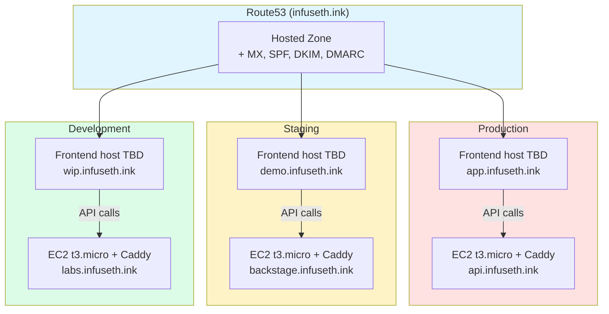

# Infuseth.ink Infrastructure as Code

> **Note:** This repo is being migrated from Pulumi (Azure) to Terraform (AWS).
> This README reflects the target state.

Infrastructure as Code for [Infuseth.ink](https://infuseth.ink) using Terraform on AWS.
Manages the backend (Python FastAPI) on EC2 and DNS via Route53.
Frontend (Next.js) is hosted separately — Netlify or Amplify Hosting are candidates.

## 🏗️ Architecture Overview

This infrastructure supports a modular, multi-environment setup.
Each environment runs the backend on a single EC2 instance with Caddy handling TLS.
The frontend is deployed separately.

### Core Architecture


```mermaid
graph TB
    subgraph prod["Production"]
        direction TB
        fe_prod["Frontend host TBD<br/>app.infuseth.ink"]
        caddy_prod["EC2 t3.micro + Caddy<br/>api.infuseth.ink"]
        fe_prod -->|API calls| caddy_prod
    end

    subgraph staging["Staging"]
        direction TB
        fe_stg["Frontend host TBD<br/>demo.infuseth.ink"]
        caddy_stg["EC2 t3.micro + Caddy<br/>backstage.infuseth.ink"]
        fe_stg -->|API calls| caddy_stg
    end

    subgraph dev["Development"]
        direction TB
        fe_dev["Frontend host TBD<br/>wip.infuseth.ink"]
        caddy_dev["EC2 t3.micro + Caddy<br/>labs.infuseth.ink"]
        fe_dev -->|API calls| caddy_dev
    end

    subgraph dns["Route53 (infuseth.ink)"]
        r53["Hosted Zone<br/>+ MX, SPF, DKIM, DMARC"]
    end

    r53 --> fe_prod & fe_stg & fe_dev

    style prod fill:#fee2e2
    style staging fill:#fef3c7
    style dev fill:#dcfce7
    style dns fill:#e1f5ff
```

### Environment Plan

> **Current scope:** Staging only. Dev and prod are planned but not yet deployed —
> starting with one always-on instance avoids stop/start overhead while the stack is being established.

#### Staging ✅ active

- **Backend**: `backstage.infuseth.ink` (Python 3.13 + FastAPI, EC2)
- **Frontend**: `demo.infuseth.ink` (Next.js, hosted separately — TBD)
- **Purpose**: QA and demo purposes — the primary working environment

#### Development 🔜 planned

- **Backend**: `labs.infuseth.ink` (Python 3.13 + FastAPI, EC2)
- **Frontend**: `wip.infuseth.ink` (Next.js, hosted separately — TBD)
- **Purpose**: Experimental — push freely, minimal coordination needed

#### Production 🔜 planned

- **Backend**: `api.infuseth.ink` (Python 3.13 + FastAPI, EC2)
- **Frontend**: `app.infuseth.ink` (Next.js, hosted separately — TBD)
- **Purpose**: Production environment with custom domains and full monitoring

### Environment Notes

- **dev**: Experimental environment where any developer can push with minimal coordination.
  Perfect for testing:
  - Remote environment issues you're not confident testing locally
  - Cookie SameSite policies and cross-origin behavior
  - CDN and caching behavior
  - Sharing a possibly unstable version with team members or stakeholders
  - Offloading backend to free up laptop resources
- **staging**: QA and demonstration environment.
  Changes require review and gatekeeps production from bugs.
  - Final QA testing before production
  - Client demonstrations and previews
- **prod**: Production environment with custom domains and full monitoring

### AWS Services Used

- **Compute**: EC2 t3.micro (Amazon Linux 2023, ap-southeast-1)
- **Proxy**: Caddy (automatic HTTPS via Let's Encrypt)
- **DNS**: Route53 hosted zone + A, MX, SPF, DKIM, DMARC records
- **Access**: SSM Session Manager (no open SSH port)
- **Secrets**: AWS Parameter Store

## 🚀 Quick Start

### Prerequisites

✅ AWS CLI authenticated (`aws configure`)
✅ [Session Manager plugin][ssm-plugin] installed
✅ `mise install` (installs uv, Terraform, tflint)
✅ `mise run setup` (installs pre-commit + commitizen via uv, sets up git hooks)

### Step 1: Deploy

```bash
terraform init
terraform plan
terraform apply
```

### Step 2: Connect to EC2

```bash
aws ssm start-session --target $(terraform output -raw instance_id)
```

### Step 3: Verify

```bash
curl https://$(terraform output -raw backend_url)
```

## 🏗️ Technical Details

### Terraform Outputs

Each workspace exports:

- `instance_id` — EC2 instance ID (for SSM)
- `public_ip` — EC2 public IP
- `zone_id` — Route53 hosted zone ID
- `name_servers` — NS records to set at registrar
- `backend_url` — Backend domain

### Architecture Notes

- One EC2 instance per environment running the backend only
- Caddy handles TLS automatically via Let's Encrypt
- No port 22 open — access via SSM Session Manager only
- Frontend (Next.js) hosted separately; Netlify and Amplify Hosting are candidates

## 🛠️ Development

Tool responsibilities are split by type:

- **mise** — versioned Go binaries: `terraform`, `tflint`, `uv`
- **uv tool** — Python CLIs: `pre-commit`, `commitizen` + `cz-conventional-gitmoji`
  - Installed via `mise run setup`; no venv or `pyproject.toml` needed

Formatting and linting:

- `terraform fmt` — HCL formatting
- `tflint` — HCL linting
- `pre-commit` — runs all checks on commit

### Commit Message Format

Use conventional commits, and they'll automatically be Gitmojified:

```bash
feat: add Route53 DKIM record
fix: resolve security group ingress rule
docs: update deployment guide
```

Or use the interactive tool:

```bash
uv run cz commit
```

## 📁 Project Structure

```
├── providers.tf         # AWS provider + version constraints
├── variables.tf         # Input variables
├── terraform.tfvars     # Variable values (non-sensitive, committed)
├── data.tf              # Data sources (AMI lookup)
├── iam.tf               # IAM role + instance profile for SSM
├── security_group.tf    # Ports 80 and 443 only
├── ec2.tf               # EC2 instance
├── user_data.sh         # Caddy setup script
├── dns.tf               # Route53 zone + DNS records
└── outputs.tf           # instance_id, public_ip, zone_id, name_servers
```

## 🔐 Security & Secrets

- No secrets committed — `terraform.tfvars` contains non-sensitive config only
- Sensitive values stored in AWS Parameter Store, referenced via `data "aws_ssm_parameter"`
- Security group allows ports 80 and 443 only — no port 22
- Instance access via SSM Session Manager (IAM-controlled)

## 💰 Cost

| Resource               | Scenario     | Monthly Cost  |
| ---------------------- | ------------ | ------------- |
| EC2 t3.micro (staging) | Running 24/7 | ~$8           |
| Route53 hosted zone    | 1            | ~$0.50        |
| **Total (current)**    |              | **~$9/month** |

When dev and prod are added, stopped instances accrue only EBS storage charges
(~$0.10/GB/month × 8GB).

> **Free tier:** 750 hours/month covers one **t3.micro** running 24/7.
> Running all three environments simultaneously exhausts the allowance in ~10 days.

## 🔧 Troubleshooting

### "No such instance"

**Solution:** Run `terraform apply` first, then use `terraform output -raw instance_id`

### "Backend not responding"

**Solutions:**

1. Connect via SSM and check Caddy logs:
   ```bash
   aws ssm start-session --target <instance-id>
   sudo journalctl -u caddy -f
   ```
2. Verify security group allows ports 80/443
3. Check `user_data.sh` ran: `cat /var/log/cloud-init-output.log`

### "terraform apply fails with permissions error"

**Solutions:**

1. Verify identity: `aws sts get-caller-identity`
2. Ensure IAM user/role has EC2, Route53, IAM permissions

## 🧹 Cleanup

To destroy everything (⚠️ **irreversible — all resources will be deleted**):

```bash
terraform destroy
```

## 🔄 Updating Infrastructure

```bash
terraform plan   # Review changes
terraform apply  # Apply changes
```

## 📊 Monitoring & Operations

### View Outputs

```bash
terraform output
```

### Connect to Instance

```bash
aws ssm start-session --target $(terraform output -raw instance_id)
```

### View Caddy Logs

```bash
# After connecting via SSM:
sudo journalctl -u caddy -f
```

<!-- References -->

[ssm-plugin]: https://docs.aws.amazon.com/systems-manager/latest/userguide/session-manager-working-with-install-plugin.html
