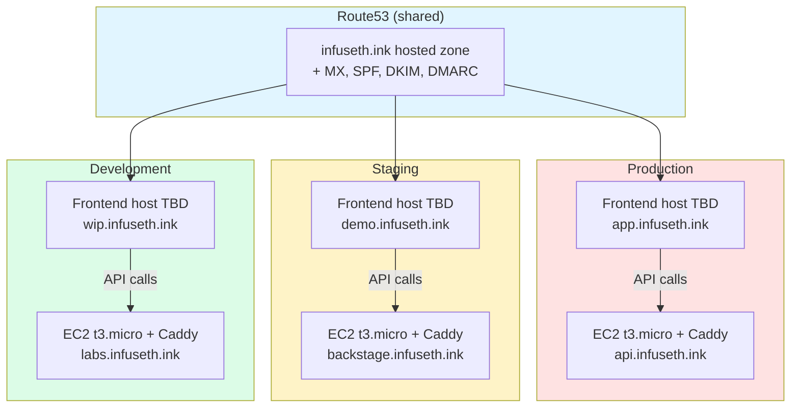

# Infuseth.ink Infrastructure as Code

Infrastructure as Code for [Infuseth.ink](https://infuseth.ink) using Terraform on AWS.
Manages the backend (Python FastAPI) on EC2 and DNS via Route53.
Frontend (Next.js) is hosted separately — Netlify or Amplify Hosting are candidates.

## 🏗️ Architecture Overview

A modular, multi-environment setup. One Route53 hosted zone is shared across all
environments (owned by `environments/shared/`); each backend environment runs on a
single EC2 instance with Caddy handling TLS.

### Core Architecture


```mermaid
graph TB
    subgraph prod["Production"]
        direction TB
        fe_prod["Frontend host TBD<br/>app.infuseth.ink"]
        caddy_prod["EC2 t3.micro + Caddy<br/>api.infuseth.ink"]
        fe_prod -->|API calls| caddy_prod
    end

    subgraph staging["Staging"]
        direction TB
        fe_stg["Frontend host TBD<br/>demo.infuseth.ink"]
        caddy_stg["EC2 t3.micro + Caddy<br/>backstage.infuseth.ink"]
        fe_stg -->|API calls| caddy_stg
    end

    subgraph dev["Development"]
        direction TB
        fe_dev["Frontend host TBD<br/>wip.infuseth.ink"]
        caddy_dev["EC2 t3.micro + Caddy<br/>labs.infuseth.ink"]
        fe_dev -->|API calls| caddy_dev
    end

    subgraph dns["Route53 (shared)"]
        r53["infuseth.ink hosted zone<br/>+ MX, SPF, DKIM, DMARC"]
    end

    r53 --> fe_prod & fe_stg & fe_dev

    style prod fill:#fee2e2
    style staging fill:#fef3c7
    style dev fill:#dcfce7
    style dns fill:#e1f5ff
```

### Environment Plan

> **Current scope:** `shared` (Route53 zone + email DNS) and `staging` (backend) are
> active. `dev` and `prod` are scaffolded but not yet applied — starting with one
> always-on instance avoids stop/start overhead while the stack is being established.

#### Shared ✅ active

- **Owns**: Route53 hosted zone for `infuseth.ink` + email DNS records (MX, SPF, DKIM, DMARC)
- **Consumed by**: all backend environments via `data "aws_route53_zone"` lookup
- **State lives in**: `environments/shared/`

#### Staging ✅ active

- **Backend**: `backstage.infuseth.ink` (Python 3.13 + FastAPI, EC2)
- **Frontend**: `demo.infuseth.ink` (Next.js, hosted separately — TBD)
- **Purpose**: QA and demo purposes — the primary working environment

#### Development 🔜 planned

- **Backend**: `labs.infuseth.ink` (Python 3.13 + FastAPI, EC2)
- **Frontend**: `wip.infuseth.ink` (Next.js, hosted separately — TBD)
- **Purpose**: Experimental — push freely, minimal coordination needed

#### Production 🔜 planned

- **Backend**: `api.infuseth.ink` (Python 3.13 + FastAPI, EC2)
- **Frontend**: `app.infuseth.ink` (Next.js, hosted separately — TBD)
- **Purpose**: Production environment with custom domains and full monitoring

### Environment Notes

- **dev**: Experimental environment where any developer can push with minimal coordination.
  Perfect for testing:
  - Remote environment issues you're not confident testing locally
  - Cookie SameSite policies and cross-origin behavior
  - CDN and caching behavior
  - Sharing a possibly unstable version with team members or stakeholders
  - Offloading backend to free up laptop resources
- **staging**: QA and demonstration environment.
  Changes require review and gatekeeps production from bugs.
  - Final QA testing before production
  - Client demonstrations and previews
- **prod**: Production environment with custom domains and full monitoring

### AWS Services Used

- **Compute**: EC2 t3.micro (Amazon Linux 2023, ap-southeast-1)
- **Proxy**: Caddy (automatic HTTPS via Let's Encrypt)
- **DNS**: Route53 hosted zone + A, MX, SPF, DKIM, DMARC records
- **Access**: SSM Session Manager (no open SSH port)
- **Secrets**: AWS Parameter Store

## 🚀 Quick Start

### Prerequisites

✅ AWS sign-in via `aws login` (uses IAM root sessions — no static keys on disk)
✅ [Session Manager plugin][ssm-plugin] installed
✅ `mise install` (installs uv, Terraform, tflint)
✅ `mise run setup` (installs pre-commit + commitizen via uv, sets up git hooks)

### Authenticating to AWS

```bash
aws login
```

The `mise run tf` task auto-exports temporary credentials into the terraform process
via `aws configure export-credentials --format env`. If creds expire mid-session,
run `aws login` again.

### Step 1: Deploy

```bash
mise run tf shared apply     # one-time: Route53 zone + email DNS
mise run tf staging apply    # backend + DNS A record
```

### Step 2: Connect to EC2

```bash
aws ssm start-session --target $(cd environments/staging && terraform output -raw instance_id)
```

### Step 3: Verify

```bash
curl https://backstage.infuseth.ink
```

## 🏗️ Technical Details

### Terraform Outputs

`environments/shared/`:

- `zone_id` — Route53 hosted zone ID
- `name_servers` — NS records to set at registrar

Each backend environment (`staging`, `dev`, `prod`):

- `instance_id` — EC2 instance ID (for SSM)
- `public_ip` — EC2 public IP

### Architecture Notes

- One EC2 instance per backend environment, running the backend only
- Caddy handles TLS automatically via Let's Encrypt
- No port 22 open — access via SSM Session Manager only
- Frontend (Next.js) hosted separately; Netlify and Amplify Hosting are candidates
- IAM role + instance profile names suffixed with environment (e.g.
  `infusethink-backend-staging`) so envs don't collide in the same AWS account

## 🛠️ Development

Tool responsibilities are split by type:

- **mise** — versioned Go binaries: `terraform`, `tflint`, `uv`
- **uv** — Python CLIs via `pyproject.toml` dep-groups: `pre-commit`, `commitizen`,
  `cz-conventional-gitmoji`, `dprint-py`
  - Installed via `mise run setup` (`uv sync --group dev` + `pre-commit install`)

Formatting and linting:

- `terraform fmt` — HCL formatting
- `tflint` — HCL linting
- `pre-commit` — runs all checks on commit

### Commit Message Format

Use conventional commits, and they'll automatically be Gitmojified:

```bash
feat: add Route53 DKIM record
fix: resolve security group ingress rule
docs: update deployment guide
```

Or use the interactive tool:

```bash
uv run cz commit
```

## 📁 Project Structure

```
modules/
├── shared/              # Route53 zone + email DNS records
│   ├── main.tf
│   ├── variables.tf
│   └── outputs.tf
└── backend/             # EC2, IAM, security group, A record
    ├── main.tf
    ├── variables.tf
    ├── outputs.tf
    └── user_data.sh     # Caddy + Docker setup script

environments/
├── shared/              # owns the Route53 zone (one per account)
├── staging/             # active backend env
├── dev/                 # scaffolded, not applied
└── prod/                # scaffolded, not applied

# Each environment dir contains:
#   main.tf              # module wiring
#   variables.tf
#   providers.tf         # AWS provider
#   versions.tf          # TF + provider version constraints
#   terraform.tfvars     # non-sensitive values, committed
#   outputs.tf
```

## 🔐 Security & Secrets

- No secrets committed — `terraform.tfvars` files contain non-sensitive config only
  (auto-loaded by terraform from each environment dir)
- Sensitive values stored in AWS Parameter Store, referenced via `data "aws_ssm_parameter"`
- Security group allows ports 80 and 443 only — no port 22
- Instance access via SSM Session Manager (IAM-controlled)
- AWS auth via `aws login` (temporary creds in `~/.aws/cli/cache/`); no long-lived
  access keys in `~/.aws/credentials`

## 💰 Cost

| Resource               | Scenario     | Monthly Cost  |
| ---------------------- | ------------ | ------------- |
| EC2 t3.micro (staging) | Running 24/7 | ~$8           |
| Route53 hosted zone    | 1            | ~$0.50        |
| **Total (current)**    |              | **~$9/month** |

When dev and prod are added, stopped instances accrue only EBS storage charges
(~$0.10/GB/month × 8GB).

> **Free tier:** 750 hours/month covers one **t3.micro** running 24/7.
> Running all three environments simultaneously exhausts the allowance in ~10 days.

## 🔧 Troubleshooting

### "ExpiredToken" from terraform

**Solution:** Re-run `aws login`, then re-run your `mise run tf ...` command.

### "No such instance"

**Solution:** Run `mise run tf staging apply` first, then look up the ID:

```bash
cd environments/staging && terraform output -raw instance_id
```

### "Backend not responding"

**Solutions:**

1. Connect via SSM and check Caddy logs:
   ```bash
   aws ssm start-session --target <instance-id>
   sudo journalctl -u caddy -f
   ```
2. Verify security group allows ports 80/443
3. Check `user_data.sh` ran: `cat /var/log/cloud-init-output.log`

### "terraform apply fails with permissions error"

**Solutions:**

1. Verify identity: `aws sts get-caller-identity`
2. Ensure the active principal has EC2, Route53, and IAM permissions

## 🧹 Cleanup

To destroy a single environment (⚠️ **irreversible**):

```bash
mise run tf staging destroy
```

> Don't destroy `shared` unless you really mean it — it owns the Route53 zone and
> email records. Destroying it will break email and force you to update NS records
> at the registrar when you re-create.

## 🔄 Updating Infrastructure

```bash
mise run tf staging plan    # review changes
mise run tf staging apply   # apply
```

## 📊 Monitoring & Operations

### View Outputs

```bash
cd environments/staging && terraform output
```

### Connect to Instance

```bash
aws ssm start-session --target $(cd environments/staging && terraform output -raw instance_id)
```

### View Caddy Logs

```bash
# After connecting via SSM:
sudo journalctl -u caddy -f
```

<!-- References -->

[ssm-plugin]: https://docs.aws.amazon.com/systems-manager/latest/userguide/session-manager-working-with-install-plugin.html
